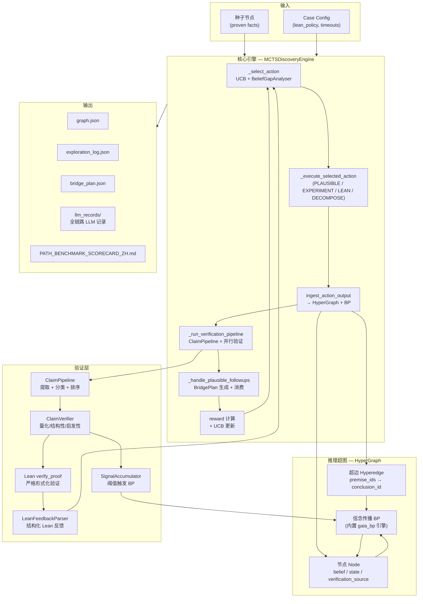
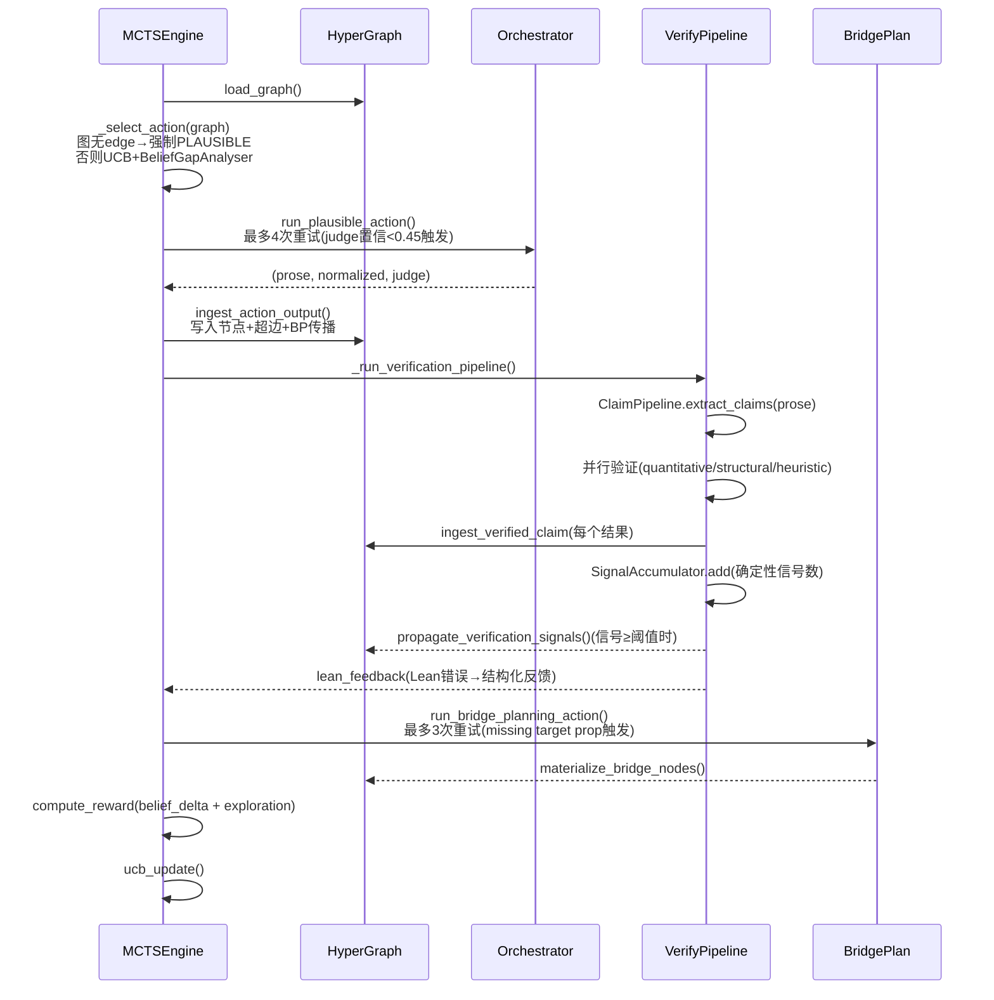
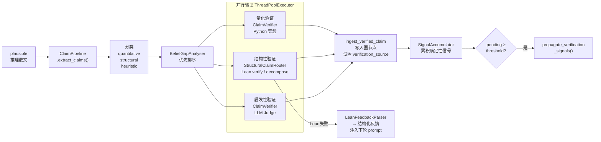

# Discovery Zero 系统架构

## 0. 架构图

### 0.1 系统总览



### 0.2 单次 MCTS 迭代流



### 0.3 验证驱动管线详情



---

## 1. 系统定位

Discovery Zero 是一个**数学发现与证明编排系统**，目标是把整个数学研究过程——猜想生成、数值实验、声称提取与验证、子目标分解、形式化证明——组织成一张可追踪、可递归推进、可部分形式化闭合的推理结构。

它不是"LLM 生成文本 → Lean 验证"的单次流水线，而是一个**迭代搜索引擎**，每一轮都把新的证据沉淀到推理超图，并驱动下一轮探索。

---

## 2. 核心数据模型

### 2.1 推理超图（HyperGraph）

底层数据结构，位于 `src/discovery_zero/graph/models.py`。

```
节点 (Node)
  ├── statement: str          # 命题自然语言
  ├── belief: float           # 置信度 [0, 1]
  ├── prior: float            # 先验（初始 0.15 用于未验证节点）
  ├── state: NodeState        # unverified | proven | refuted
  ├── verification_source     # 来源：lean | experiment | llm_judge
  └── memo_ref                # 关联的 ResearchMemo ID

超边 (Hyperedge)
  ├── premise_ids: list[str]  # 多前提（支持真实数学推理）
  ├── conclusion_id: str
  ├── module: Module          # plausible | experiment | lean | ...
  ├── confidence: float
  └── claim_refs: list[str]   # 关联的 Claim ID
```

### 2.2 ResearchMemo 与 Claim（`graph/memo.py`）

LLM 推理输出不再是碎片节点，而是结构化为 **ResearchMemo**（研究备忘录），包含一组可独立验证的 **Claim**：

```
ResearchMemo
  └── claims: list[Claim]
        ├── claim_type: ClaimType       # quantitative | structural | heuristic
        ├── verification_status         # pending | verified | refuted | inconclusive
        ├── confidence: float
        └── evidence: str

VerificationResult
  ├── verdict: verified | refuted | inconclusive
  ├── confidence_delta: float
  ├── lean_error: str                   # Lean 编译错误（如有）
  └── backend: experiment | lean | llm_judge
```

---

## 3. 主执行引擎：MCTS Discovery Engine

位于 `src/discovery_zero/planning/mcts_engine.py`，通过 `DISCOVERY_ZERO_ENABLE_MCTS=true` 启用。

### 3.1 整体循环

```
for iteration in 1..max_iterations:
    graph = load_graph()
    (node_id, module) = _select_action(graph)      # UCB 驱动的动作选择
    action_result = _execute_selected_action(...)   # 执行选定模块
    action_result = ingest_action_output(...)       # 结果写入超图 + BP
    if module == PLAUSIBLE:
        _run_verification_pipeline(...)             # NEW: 声称提取与并行验证
        _handle_plausible_followups(...)            # 桥接计划 + 后续动作
    record_reward_and_update_ucb()
```

### 3.2 动作选择（`_select_action`）

优先级从高到低：

1. **图无 edge 时**：强制 PLAUSIBLE（首次迭代必须先建立推理路径）
2. **BeliefGapAnalyser**：找关键路径上置信度最低的节点，按 claim 类型路由：
   - structural → LEAN
   - quantitative → EXPERIMENT
   - heuristic/other → PLAUSIBLE
3. **HTPS + RMaxTS UCB**：基于历史访问记录和奖励的 UCB 驱动选择

`_infer_claim_type` 优先检查 structural 关键词（`conjecture`、`theorem`、`for all` 等），再检查数字/符号，避免把含有数学符号的 theorem 误判为 quantitative。

### 3.3 执行层（`_execute_selected_action`）

| Module | 调用 | LLM 记录 |
|--------|------|---------|
| PLAUSIBLE | `run_plausible_action` | `plausible_prose_attempt_{n}.txt` |
| EXPERIMENT | `run_experiment_action` | `experiment_prose_attempt_{n}.txt`、`experiment_code_attempt_{n}.py` |
| LEAN | `run_lean_action` | `lean_prose_attempt_{n}.txt`、`lean_code_attempt_{n}.lean` |
| DECOMPOSE | `run_lean_decompose_action` | `decompose_prose_attempt_{n}.txt`、`decompose_skeleton_attempt_{n}.lean` |

各模块内部重试策略：

- **Plausible**：最多 `engine_plausible_max_attempts`（默认4）次。Judge 置信度 < 0.45，或 Judge 推理包含负面关键词（gap/invalid/unjustified...），触发重试并将 Judge 反馈注入下一次 prompt。
- **Lean/Decompose**：最多3次，Lean 编译报错直接贴回 prompt。
- **Experiment**：单次 LLM 调用，内部最多3次代码修复（`_execute_with_repair`）。

---

## 4. 验证驱动管线

每次 PLAUSIBLE 成功后，**在桥接计划物化之后**执行（`_run_verification_pipeline`）。

**核心设计原则**：验证管线在 bridge plan 物化之后运行，bridge 节点已在图中，claim 通过 `bridge_proposition_id` 精确映射到 bridge 节点写回，无需文本匹配。

### 4.1 流程

```
plausible prose
    ↓
_handle_plausible_followups           # 【先】生成 bridge plan
    ├── materialize_bridge_nodes       # 物化命题节点
    │     ├── TARGET 强制映射到 MCTS target 节点
    │     └── depends_on → 创建超边（bridge 依赖链进图）
    └── bridge_node_map: {P1→node_abc, P3→node_def, TARGET→mcts_target}
    ↓ bridge_plan + bridge_node_map
ClaimPipeline.extract_claims          # LLM 提取 Claim + bridge_proposition_id
    ↓
ClaimPipeline.prioritize_claims       # 按新颖性、关键路径相关性排序
    ↓
ThreadPoolExecutor (并行验证)
    ├── quantitative → ClaimVerifier (Python 实验)
    ├── structural   → StructuralClaimRouter (Lean 或 LLM Judge)
    └── heuristic    → ClaimVerifier._verify_heuristic_claim (LLM Judge)
    ↓
ingest_verified_claim (每个结果)
    ├── 有 bridge_proposition_id → target_node_id = bridge_node_map[id] (精确写入)
    └── 无映射 → 新建节点 + parent_edge_id 创建超边（不再成为孤儿）
    ↓
VR.claim_id = 真实图节点 ID           # propagate_verification_signals 可定位
    ↓
SignalAccumulator → propagate_verification_signals  # BP 沿 bridge 依赖链传播
    ↓
LeanFeedbackParser                     # 解析 Lean 错误 → 结构化反馈
    ↓
verification_bonus → MCTS reward      # 验证结果反馈搜索
```

### 4.2 `materialize_bridge_nodes` 两阶段

- **Pass 1**（节点）：`role="target"` 强制映射到 `target_node_id`，消除 bridge TARGET 和 MCTS target 节点重复问题。其他节点文本匹配或新建。
- **Pass 2**（超边）：为每个 `depends_on` 关系创建超边，`confidence` 取 `BRIDGE_GRADE_CONFIDENCE[grade]`（A:0.95, B:0.75, C:0.55, D:0.35），具备幂等去重。

### 4.3 Lean 触发条件

`enable_lean_claim_verify = enable_strict_lean AND enable_decomposition`

对于 frontier open problem，结构性声称不走真实 Lean（避免耗尽时间），而走 LLM Judge 评估。

### 4.4 LLM 记录文件

| 阶段 | 文件 |
|------|------|
| 声称提取 | `claim_extraction_attempt_{n}.txt` |
| 量化验证（代码） | `claim_verify_quant_{i}_code.py`、`claim_verify_quant_{i}_result.txt` |
| 结构性验证（Lean） | `claim_verify_struct_{i}_prose.txt`、`claim_verify_struct_{i}_code.lean` |
| 结构性分解 | `structural_decompose_prose_{i}.txt`、`structural_decompose_skeleton_{i}.lean` |
| Heuristic 判断 | `claim_verify_heuristic_{i}_prose.txt` |
| Lean gap 分析 | `lean_gap_analysis_{i}.txt` |

---

## 5. 桥接计划层（Bridge Plan）

位于 `src/discovery_zero/planning/bridge.py` 和 `orchestrator.py`。

Plausible 成功后，`_handle_plausible_followups` 调用 `run_bridge_planning_action` 生成桥接计划：

```json
{
  "target_statement": "...",
  "propositions": [
    {"id": "P1", "role": "seed", "grade": "A", ...},
    {"id": "P3", "role": "bridge", "grade": "C", ...},
    {"id": "TARGET", "role": "target", "grade": "B", ...}
  ],
  "chain": [...],
  "summary": "..."
}
```

**命题等级**：
- Grade A/B：Lean 候选（`plan_bridge_consumption` 分配给 strict Lean 或 Lean decompose）
- Grade C：实验候选（`delegated_to_experiment`）
- Grade D：自然语言候选（保留为推理依据，不进入形式化）

`_handle_plausible_followups` 最多重试3次，每次把上次验证错误（如缺少 `role: target` 命题）回注 prompt。

---

## 6. 信念传播（Belief Propagation）

位于 `src/discovery_zero/graph/inference.py`，底层调用仓库内置的 Gaia BP 引擎（`src/gaia_bp` + `libs/inference_v2`）。

### 6.1 Factor 类型

BP 引擎（`src/gaia_bp/`）支持以下 `FactorType`：

| FactorType | 语义 | 参数 | 用途 |
|-----------|------|------|------|
| `ENTAILMENT` | A → B（原始蕴含） | `p` | Gaia 原生 |
| `INDUCTION` / `ABDUCTION` | 归纳/溯因推理 | `p` | Gaia 原生 |
| `CONTRADICTION` | A ⊥ B | `p` + `relation_var` | 矛盾约束 |
| `EQUIVALENCE` | A ↔ B | `p` + `relation_var` | 等价约束 |
| `CONJUNCTION` | M = A₁ ∧ ... ∧ Aₖ | `p`（确定性） | 多前提合取中间变量 |
| `SOFT_IMPLICATION` | A ↝ B（双参数） | `p1`, `p2` | 条件概率蕴含 |

`adapter_v2.py` 将超图边映射为 factor：
- **单前提边**：直接用 `SOFT_IMPLICATION(A → B)`
- **多前提边**：先 `CONJUNCTION(A₁,...,Aₖ → M)`，再 `SOFT_IMPLICATION(M → B)`
  - 当前提数量超过 `MAX_CONJUNCTION_ARITY`（默认 6）时，自动拆分为链式小 CONJUNCTION 以避免 BP 表操作的指数内存消耗（`(A∧B∧C) ∧ (D∧E∧F) → M`，数学上等价于 `A∧B∧C∧D∧E∧F → M`）
- **同结论边去重**：同模块指向相同结论的 plausible 边合并为单因子，effective p1 使用指数衰减
- **矛盾/等价**：创建 `relation_var`（prior=1-ε）并用对应的 `FactorType`；CONTRADICTION 当前由 BP modus tollens 处理，不生成显式因子

### 6.2 两种触发方式

1. **传统 BP**（每次 ingest 后）：`propagate_beliefs(graph)` — 全图 Loopy BP
2. **验证信号触发 BP**（NEW）：`propagate_verification_signals`
   - 每个 verified/refuted 声称计为一个确定性信号
   - `SignalAccumulator` 累积到 `bp_propagation_threshold`（默认1）后批量传播
   - 避免每个小更新都触发全图 BP

### 6.2 信念值含义

| 来源 | 写入 belief | state |
|------|------------|-------|
| Lean 严格验证 | 1.0 | proven |
| 实验验证（passed） | 0.85 | unverified |
| LLM Judge 验证 | +0.3 delta，上限 0.7 | unverified |
| 实验驳斥（counterexample） | weakened，-delta | unverified |
| 实验驳斥（严重） | 0.0 | refuted |

---

## 7. Lean 验证层

位于 `src/discovery_zero/tools/lean.py`。

### 7.1 严格证明（`verify_proof`）

- 写入 `Proofs.lean`，运行 `lake build`
- 拒绝 `sorry`/`admit`
- 成功则 state → proven，belief → 1.0

### 7.2 子目标分解（`decompose_proof_skeleton`）

- 将 skeleton 中的 `sorry` 改为 `exact ?_`
- 运行 `lake env lean`，解析 unsolved goals
- 每个 goal 成为图中新节点（递归推进目标）

### 7.3 Lean Policy（case config 控制）

```json
"lean_policy": {
  "mode": "selective",
  "enable_decomposition": true,
  "enable_strict_lean": true,
  "min_path_confidence": 0.6,
  "max_grade_d_ratio": 0.3,
  "allowed_strict_modes": ["direct_proof", "lemma"]
}
```

`should_attempt_lean` 在线性 pipeline 中使用；MCTS 中由 `lean_policy` dict 直接控制引擎行为。

---

## 8. 基准测试框架

### 8.1 运行方式

```bash
DISCOVERY_ZERO_ENABLE_MCTS=true \
DISCOVERY_ZERO_VERIFICATION_LOOP_ENABLED=true \
DISCOVERY_ZERO_LEAN_FEEDBACK_ENABLED=true \
LITELLM_PROXY_API_BASE=... \
LITELLM_PROXY_API_KEY=... \
DISCOVERY_ZERO_LLM_MODEL=cds/Claude-4.6-opus \
PYTHONPATH="$(pwd)/src:$(pwd)" \
python scripts/run_benchmark_suite.py \
  --suite evaluate/suite_lonely_runner_single.json \
  --repeats 1 \
  --output-root evaluate/workspaces
```

### 8.2 输出目录结构

```
evaluate/workspaces/runs/{suite_id}/{timestamp}/{case_id}/run_{N}/
  ├── graph.json                    # 超图快照
  ├── exploration_log.json          # 完整步骤日志（含 steps / snapshots）
  ├── bridge_plan.json              # 最优桥接计划
  ├── summary.json                  # 指标摘要
  ├── PATH_BENCHMARK_SCORECARD_ZH.md
  └── llm_records/
        ├── plausible_prose_attempt_{n}.txt
        ├── bridge_plan_prose_attempt_{n}.txt
        ├── claim_extraction_attempt_{n}.txt
        ├── experiment_prose_attempt_{n}.txt
        ├── experiment_code_attempt_{n}.py
        ├── experiment_result_attempt_{n}.txt
        ├── lean_prose_attempt_{n}.txt
        ├── lean_code_attempt_{n}.lean
        ├── decompose_prose_attempt_{n}.txt
        ├── decompose_skeleton_attempt_{n}.lean
        ├── claim_verify_quant_{i}_*.{txt,py}
        ├── claim_verify_struct_{i}_*.{txt,lean}
        ├── claim_verify_heuristic_{i}_prose.txt
        ├── structural_decompose_*.{txt,lean}
        ├── structural_verify_*.{txt,lean}
        └── lean_gap_analysis_{i}.txt
```

### 8.3 关键评测指标

| 指标 | 含义 |
|------|------|
| OFC | 综合前沿能力得分 |
| FRI | 形式化严格性（Lean 参与度） |
| PQI | 路径质量（bridge plan Grade 分布） |
| ESI | 实验强度（实验次数、覆盖深度） |
| DBI | 发现广度（新节点数量） |
| ORI | 开放性研究指标（新颖性） |
| claims_extracted_per_iteration | 验证驱动管线活跃度 |
| verification_driven_belief_progress | 通过验证提升的 belief 总量 |

---

## 9. 关键配置变量

| 环境变量 | 默认 | 含义 |
|---------|------|------|
| `DISCOVERY_ZERO_ENABLE_MCTS` | false | 启用 MCTS 引擎 |
| `DISCOVERY_ZERO_VERIFICATION_LOOP_ENABLED` | true | 启用 ClaimPipeline + SignalAccumulator |
| `DISCOVERY_ZERO_LEAN_FEEDBACK_ENABLED` | true | 启用 LeanFeedbackParser + StructuralClaimRouter |
| `DISCOVERY_ZERO_VERIFICATION_PARALLEL_WORKERS` | 3 | 并行验证线程数 |
| `DISCOVERY_ZERO_BP_PROPAGATION_THRESHOLD` | 1 | 触发 BP 所需的最低确定性信号数 |
| `DISCOVERY_ZERO_MAX_CLAIMS_PER_MEMO` | 10 | 每次 plausible 最多提取声称数 |
| `DISCOVERY_ZERO_MAX_DECOMPOSE_DEPTH` | 4 | 结构性声称最大分解深度 |
| `DISCOVERY_ZERO_MCTS_MAX_ITERATIONS` | 50 | MCTS 最大迭代次数 |
| `DISCOVERY_ZERO_MCTS_MAX_TIME_SECONDS` | 3600 | MCTS 最大运行时间（秒） |
| `DISCOVERY_ZERO_ENGINE_PLAUSIBLE_MAX_ATTEMPTS` | 4 | 单次迭代 plausible 最大重试次数 |
| `DISCOVERY_ZERO_UNVERIFIED_CLAIM_PRIOR` | 0.15 | 未验证节点默认先验 |

---

## 10. 代码目录结构

```
src/
  discovery_zero/            # 核心源码
    graph/
      models.py              # HyperGraph, Node, Hyperedge
      memo.py                # ResearchMemo, Claim, VerificationResult, ClaimType
      ingest.py              # ingest_skill_output, ingest_verified_claim
      inference.py           # propagate_beliefs, propagate_verification_signals, SignalAccumulator
      inference_energy.py
      persistence.py
      adapter.py             # Gaia v1 适配层
      adapter_v2.py          # Gaia v2 适配层（CONJUNCTION / SOFT_IMPLICATION）
    planning/
      mcts_engine.py         # MCTSDiscoveryEngine（主引擎）
      orchestrator.py        # run_plausible/experiment/lean/bridge_planning_action
      claim_pipeline.py      # ClaimPipeline（提取 + 分类 + 优先级）
      claim_verifier.py      # ClaimVerifier（量化/结构性/启发性验证）
      lean_feedback.py       # LeanFeedbackParser, StructuralClaimRouter
      verification_loop.py   # VerificationLoop（CLI 独立入口）
      bridge.py              # BridgePlan, materialize_bridge_nodes
      discovery_engine.py    # BeliefGapAnalyser
      search.py              # RMaxTSSearch, SearchState, select_module_ucb
      htps.py                # HTPS path selection
      decompose.py           # DecomposeEngine
      analogy.py / specialize.py / knowledge_retrieval.py
      expert_iteration.py    # ExperienceBuffer
    tools/
      llm.py                 # chat_completion, run_skill (含 record_path 支持)
      lean.py                # verify_proof, decompose_proof_skeleton
      experiment_backend.py
    benchmark.py             # run_suite, run_case_once, _run_case_once_mcts
    config.py                # ZeroConfig（所有配置项）
    cli.py                   # typer CLI
    skills/                  # LLM skill prompt 文件
  gaia_bp/                   # 内置 Gaia BP 引擎（vendor + 扩展）
    factor_graph.py          # FactorGraph, FactorType（含 CONJUNCTION / SOFT_IMPLICATION）
    potentials.py            # 势函数（含 conjunction / soft_implication）
    engine.py                # InferenceEngine（Loopy BP / JT / GBP / Exact）
    exact.py                 # 精确推理
    jt.py                    # Junction Tree
    gbp.py                   # Generalized BP
libs/                        # 推理兼容层
  inference_v2/              # Gaia v2 shim → gaia_bp
  inference/                 # Gaia v1 推理
  graph_ir/                  # Gaia Graph IR 持久化模型
  storage/                   # Gaia 存储组件
  embedding.py               # 嵌入模型
evaluate/
  suite.json
  cases/
    lonely_runner_n11/
    homochirality_mechanism/
```

---

## 11. 架构演进：已修复问题与残余局限

### 2026-03-26 重构已修复的关键断裂

以下问题在之前的重构中已全部修复：

1. **Claim 节点孤立**（原硬伤1/3） — 通过 `bridge_proposition_id` + `bridge_node_map` 实现 ID 级精确写回，验证结果直接更新 bridge 命题节点的 belief，不再依赖文本匹配
2. **MCTS 对验证结果盲目**（原硬伤2） — `verification_bonus` 加入 reward 计算，验证质量直接影响 UCB 排序
3. **`materialize_bridge_nodes` 建边** — Pass 2 翻译 `depends_on` 为超边
4. **Bridge TARGET / MCTS target 节点重复** — `target_node_id` 参数强制映射
5. **执行顺序** — bridge plan 在验证管线之前执行
6. **`propagate_verification_signals` 定位节点** — `VR.claim_id` 回写为真实图节点 ID
7. **`old_style_results` 重复处理** — 有 bridge mapping 时不收录 `ClaimVerificationResult`
8. **grade-confidence 硬编码** — 提取为 `BRIDGE_GRADE_CONFIDENCE` 常量
9. **Bridge followups 只验证1个 proposition** — 扩展 `max_rounds` 覆盖所有实验 proposition

### 2026-03-30 BP 引擎自包含

- Gaia BP 引擎完整 vendor 到 `src/gaia_bp/`，项目不再依赖外部 Gaia 仓库
- 新增 `CONJUNCTION` 和 `SOFT_IMPLICATION` FactorType（详见 §6.1），精确表达多前提合取和条件概率蕴含
- `adapter_v2.py` 重写：多前提边正确分解为 CONJUNCTION → SOFT_IMPLICATION 两步 factor
- `CONTRADICTION` / `EQUIVALENCE` 正确生成 `relation_var`

### 2026-03-31 工业级加固（Industrial Hardening）

**BP 纯度 & Gaia 理论合规**
- `propagate_verification_signals` 简化为纯 BP 触发器，不再直接修改 `node.prior`/`node.belief`
- `ingest.py` 中软证据（实验结果）只修改 `node.prior`，`belief` 由 BP 计算
- 分解边（decomposition edges）纳入 BP，作为 `SOFT_IMPLICATION` factor 传播证据
- Gaia BP 理论 docstring 修正（`CONJUNCTION`/`SOFT_IMPLICATION` 参数语义）

**MCTS 鲁棒性**
- 迭代内 `try/except` 异常安全：action 失败不丢失图状态，自动 `continue` 下一轮
- 超时解耦：`post_action_budget_seconds` 保证 ingest+BP 优先于 bridge/verification
- target 节点隔离检测：连续 3 轮无入边时强制对根目标执行 PLAUSIBLE
- Action checkpoint 持久化到 `action_checkpoints/iter_XXXX_action_result.json`

**LLM 请求优化**
- `_StreamingTextRecorder` 追踪实际文本字节而非 SSE 原始字节，修复 thinking token 导致的过早截断
- 移除人为 LLM 输出限制（word limit prompt、`max_prose_bytes` 硬上限、auto-continue 字节上限）
- Bridge extraction 对 Opus 模型自动降级到 GPT-5.2（结构化 JSON 提取更可靠）

**Benchmark 鲁棒性**
- `SIGTERM` + `SIGHUP` 双信号处理，支持 `screen -X quit` 优雅终止
- 信号 handler 正确保存/恢复（不再强制 `SIG_DFL`）
- `_generate_partial_summary` 移入 outermost `finally`，保证崩溃/终止场景下必定生成 `summary.json`
- proofs 文件恢复与 summary 生成互相独立，不会互相阻塞

**监控工具**
- `monitor_runs.py` 修复 target belief 显示：通过 `resolved_proof_config.json` 精确匹配目标节点
- 三级 fallback：graph.json 语句匹配 → snapshot 语句匹配 → 最低 belief 未验证节点

**死代码清理**
- 移除空的 `MODEL_WORD_LIMITS` 字典和未被调用的 `_resolve_model_word_limit` 函数

### 残余局限

**局限1：实验代码浮点精度误报**

LLM 生成的实验代码用浮点网格采样（如10万点），当最优时刻是有理数（如 t=1/11）且网格不精确时，可能把"差 9e-6"的情况误报为反例。已有 `|threshold - best_min_dist| < 1e-4` 的守卫将接近阈值的结果降为 inconclusive，但 LLM 生成的代码本身不做有理数精确验证。改进方向：在实验 skill prompt 中要求对小规模输入用分数运算穷举。

**局限2：Lean claim verification 对 frontier 问题语义错位**

结构性声称在 frontier 问题中往往是未证明猜想，Lean 无法构造证明。已通过 `enable_lean_claim_verify = enable_strict_lean AND enable_decomposition` 守卫对 frontier 问题关闭 Lean claim verification。残余问题：关闭后结构性声称仍走 LLM Judge（`_verify_heuristic_claim`），可考虑更精细的路由策略。

**局限3：跨 run 不继承图状态**

同一 case 的多次 repeat（run_01, run_02...）各自从 seed config 构建新图，不继承上一次 run 的探索成果。`experience_buffer` 可跨 run 共享用于训练，但图层面每次从头开始。

---

## 12. 架构演进说明

相较于旧版（纯线性 pipeline），当前架构的核心变化：

1. **MCTS 驱动取代线性顺序**：动作选择由 UCB + BeliefGapAnalyser 驱动，而非固定的 plausible → experiment → lean 顺序。

2. **验证驱动取代信念漂移**：每次 plausible 后提取声称并并行验证，验证结果直接写入图，BP 只在积累足够确定性信号后触发。

3. **Claim 作为一等公民**：LLM 输出不再直接变成图节点，而是先经过 ClaimPipeline 分类、优先排序，再经过验证后才以 `ingest_verified_claim` 写入。

4. **全链路 LLM 记录**：plausible、bridge plan、实验代码生成、Lean 代码生成、声称提取、声称验证等每一次 LLM 调用都有独立文件记录在 `llm_records/`。

5. **Lean 的角色**：从"每次都跑 Lean"变为"选择性触发"——声称验证层默认用 LLM judge（快速），只有 bridge plan 中的 Grade A/B 命题且策略允许时才触发真实 Lean 编译。
